# Smartsheet Controller — Roadmap

> Document de pilotage des sprints d'amélioration.
> Statut global, journal, et checklist détaillée par sprint.
> **À mettre à jour après chaque session de travail.**

---

## Statut global

| ✓ | Sprint | Thème | Statut | Démarré | Terminé | Notes |
|---|---|---|---|---|---|---|
| ☑ | S0 | Bug Squash + Watch wiring | **Terminé** | 2026-04-08 | 2026-04-08 | Prérequis pour tout le reste |
| ☑ | S1 | Frictionless First Use | **Terminé** | 2026-04-08 | 2026-04-08 | Parallèle de S2 |
| ☑ | S2 | Mobile + A11y | **Terminé** | 2026-04-08 | 2026-04-08 | Parallèle de S1 |
| ☑ | S3 | Power User Velocity | **Terminé** | 2026-04-08 | 2026-04-08 | Le sprint "wow" |
| ☑ | S4 | Smarter Agent | **Terminé** | 2026-04-08 | 2026-04-08 | Réduit coût LLM |
| ☑ | S5 | Server Memory (SQLite) | **Terminé** | 2026-04-08 | 2026-04-08 | Parallèle de S6 |
| ☑ | S6 | Coverage Push | **Terminé** | 2026-04-08 | 2026-04-08 | 19 nouveaux tools, 73 au total |
| ☑ | S7 | Test Harness | **Terminé** | 2026-04-08 | 2026-04-08 | 111 tests (92 unit + 15 integration + 4 e2e), `pytest` vert |
| ☑ | S7+ | Robustness Pack | **Terminé** | 2026-04-08 | 2026-04-08 | +135 tests : agent loop, dispatch contract 73 tools, MCP smoke, endpoints HTTP complets, webhook entrant, WS cancel/confirm/rate-limit. **246 tests verts (3min38)** |

**Légende statut** : `Non démarré` / `En cours` / `En revue` / `Terminé` / `Reporté`
**Cases** : ☐ à faire · 🟡 en cours · ☑ terminé

---

## Roadmap visuelle

```mermaid
gantt
    title Roadmap des sprints
    dateFormat  X
    axisFormat  J%d

    section Critique
    S0 - Bug Squash             :s0, 0, 2d
    section Fluidité
    S1 - First Use              :s1, after s0, 4d
    S2 - Mobile + A11y          :s2, after s0, 4d
    section Wow
    S3 - Power Velocity         :s3, after s1, 5d
    section Cerveau
    S4 - Smarter Agent          :s4, after s3, 4d
    section Produit
    S5 - Server Memory          :s5, after s4, 7d
    S6 - Coverage Push          :s6, after s4, 6d
    section Qualité
    S7 - Test Harness           :s7, after s6, 2d
```

---

## Décisions de cadrage (arrêtées le 2026-04-08)

- [x] **Watch mode** → **Brancher dans S0** (scope minimal : bouton header + popover + toast)
- [x] **Cible utilisateur** → **Les deux** (équipe interne + SaaS multi-tenant). S5 et S6 en parallèle après S4.
- [x] **Mobile** → **Parallèle de S1** (S1 et S2 démarrent en même temps, commits séparés)
- [x] **Budget LLM** → **Wow d'abord** (S3 avant S4 — l'UX vend, l'optim suit)
- [x] **Persistance S5** → **SQLite** (zéro config, fichier unique, migration Postgres triviale plus tard)

---

## Sprint 0 — Bug Squash + Watch Mode wiring

**Objectif :** nettoyer la dette technique ET livrer le watch mode (différenciateur produit).
**Effort :** 1–2 jours
**Risque :** Très faible
**Statut :** **Terminé** (2026-04-08)

### Checklist

#### Bug fixes
- [x] `loadConversation` : appliquer copy/pin sur les bulles restaurées (parité avec live)
- [x] Pinned message : cliquer → scroll + highlight (`pin-flash` animation), clic-droit pour unpin
- [x] `Escape` ferme aussi Settings et le Tour (cohérence avec shortcuts modal)
- [x] `switch_model` accepte `api_key` dans le body (avec `needs_key` flag dans la réponse 400)
- [x] Print CSS : corrigé sélecteurs (IDs au lieu de classes) + ajout des nouveaux modals/badges
- [x] Suppression du code `tryAutoReconnect` orphelin (déjà fait en session précédente)

#### Watch mode (brancher l'existant)
- [x] Bouton "Watch" dans le header (icône œil) + indicateur point pulsant vert quand actif
- [x] Popover au clic : checkbox "Watch this sheet" + select intervalle (30s / 1min / 5min / 10min)
- [x] Wire `startWatch()` / `stopWatch()` → envoi WS `{type:"watch", enabled, interval}` au backend existant
- [x] Toast notification + entrée tool dans le chat ("17:42 — 1 new row(s)")
- [x] Persistance par sheet_id dans `localStorage` (clé `ss_ctrl_watch_<sheetId>`)
- [x] Restauration auto du watch state à la connexion WS et au switch de sheet
- [x] Stop automatique du watch au switch de sheet et à la déconnexion

### Critères d'acceptation
- Aucun code mort référencé (lint passe, JS sans erreurs console)
- Tous les modals/overlays se ferment avec `Esc`
- Switch de provider fonctionne avec une clé fournie au runtime
- Démo Watch : modifier une ligne dans Smartsheet → toast dans l'UI en <interval+5s

---

## Sprint 1 — Frictionless First Use

**Objectif :** un nouvel utilisateur arrive, comprend, connecte et envoie son 1er message en **moins de 60 secondes**, sans lire de doc.
**Effort :** 3–4 jours
**Risque :** Faible
**Statut :** **Terminé** (2026-04-08)

### Checklist

- [x] **Empty state riche** dans le chat : 4 cartes "Try this" cliquables avec icône/titre/description (auto-injectées par le welcome)
- [x] **Token validation live** : badge "Looks valid" / "Too short" / "Looks malformed" temps réel + skeleton pendant l'appel `/api/validate-token`
- [x] **Erreurs contextuelles** : helper `friendlyTokenError()` mappant 401/403/429/5xx/network → titre + hint clair
- [x] **Tour v2** : skip-able (toast confirmant), "Replay onboarding tour" dans Settings, +2 étapes (input + watch mode), persistance via `ss_ctrl_tour_done`
- [x] **Welcome dynamique** : analyse heuristique sheet (statut/date/owner/numérique) → 4 cartes adaptatives + hints (sheet vide / large / wide)
- [x] **Reconnect 1-clic** : banner persistant après échec des retries WS, bouton "Reconnect" réutilisant `sessionId` sans reload
- [x] **First-message hint** : pulse subtil 3× sur les try-cards après 10s d'inactivité (annulé dès première frappe), respecte `prefers-reduced-motion`

### Critères d'acceptation
- Démo : un user lambda + un token valide → conversation utile en <60s, montre en main.
- Welcome message change selon le contenu de la sheet.

---

## Sprint 2 — Mobile + A11y

**Objectif :** utilisable au téléphone et au clavier seul. Aujourd'hui le mobile est cassé.
**Effort :** 3–4 jours
**Risque :** Faible
**Statut :** **Terminé** (2026-04-08)

### Checklist

- [x] **Bottom sheet drawer** sur mobile pour history (backdrop cliquable, animation `drawerUp`, fermeture via toggle/backdrop)
- [x] **Header collapsable** sur mobile : burger `#btn-burger` (visible <900px), `mobile-menu-open` → `flex-wrap` qui empile les boutons secondaires, masqué tant que non connecté
- [x] **Modal a11y pass** : `role="dialog"`, `aria-modal="true"`, `aria-labelledby`, focus trap (`trapFocus`/`releaseFocus`), retour focus au déclencheur, `Escape` déjà câblé
- [x] **`aria-label`** sur tous les boutons icônes (mic, send, stop, copy, pin, watch, settings, history, shortcuts, export, burger) + `aria-hidden="true"` sur les `<svg>`
- [x] **`prefers-reduced-motion`** : media query globale (background, typing, watch dot, pin flash, toast, screen transitions, tour, drawer)
- [x] **Skeletons activés** : `validate-skeleton` pendant `/api/validate-token` (3 lignes shimmer)
- [x] **Contrast pass WCAG AA** : `--text-secondary` `#8B95B0`→`#A1ADCC`, `--text-muted` `#5A6480`→`#7E8AA8`, `tour-highlight` plus contrasté

### Critères d'acceptation
- Tout le flow (connect → chat → settings → history) fonctionne sur un viewport 375px.
- Lighthouse a11y score ≥ 90.
- Navigation full-keyboard de bout en bout testée.

---

## Sprint 3 — Power User Velocity

**Objectif :** transformer les utilisateurs power en évangélistes. Le sprint "wow".
**Effort :** 4–5 jours
**Risque :** Modéré (nouvelles features)
**Statut :** **Terminé** (2026-04-08)

### Checklist

- [x] **Slash commands** : `/summarize`, `/find`, `/formula`, `/chart`, `/analyze`, `/template`, `/help`, `/clear` avec autocomplete (↑↓⏎/Tab/Esc), filtre live, expansion serveur-side, `/help` & `/clear` purement client
- [x] **Drag & drop CSV** : overlay full-page (drag enter/leave/drop), parser CSV/TSV maison (gestion quotes), preview modal (10 premières lignes, nom éditable, meta lignes/colonnes), endpoint `POST /api/csv-to-sheet` (création sheet + add_rows par batch de 250, max 5000), switch automatique vers la nouvelle sheet
- [x] **TTS sortie voix** : bouton speaker sur chaque message assistant (live, streaming, history), `speechSynthesis` natif, détection FR/EN heuristique, voix locale-matchée, animation pulse pendant lecture, stop via clic ou Esc, cleanup au disconnect, respecte `prefers-reduced-motion`
- [x] **Templates / Saved Prompts** : storage `localStorage` (`ss_ctrl_templates_v1`), section dédiée dans Settings, éditeur modal CRUD, placeholders `{{var}}` avec `prompt()` interactif, intégration `/template <name>`, validation nom (alphanum + `-_.`)
- [x] **Diff view destructive** : backend `_compute_diff()` (fetch row-by-row état actuel pour `update_rows`/`delete_rows`/`add_rows`), payload `confirm_action.diff` enrichi, frontend rendu différencié par kind (table cellulaire avec strike+→ pour update, pills pour delete/add), variant `danger` pour delete, fallback raw args si diff indisponible
- [x] **Inline sparklines** : `addSparklinesIn()` post-render markdown, détection colonnes ≥70% numériques (parsing locale-aware €$%, virgule/point), SVG natif (path + dot final, vert ↑/orange ↓), `<tfoot>` avec mini meta (▲▼ min·avg·max)

### Critères d'acceptation
- ✅ Démo : 8 slash commands fonctionnent avec autocomplete fluide.
- ✅ Drag d'un CSV → preview puis confirmation → nouvelle sheet créée dans Smartsheet.
- ✅ TTS lit les réponses en français/anglais selon la locale.
- ✅ Templates éditables/dupliquables avec variables.
- ✅ Confirm cards montrent before/after avec diff visuel par cellule.
- ✅ Tables numériques affichent sparklines + min/avg/max automatiquement.

---

## Sprint 4 — Smarter Agent

**Objectif :** agent plus rapide, moins cher, plus fiable. Invisible mais énorme effet.
**Effort :** 3–4 jours
**Risque :** Modéré (touche au prompt + flux LLM)
**Statut :** **Terminé** (2026-04-08)

### Checklist

- [x] **Tool subsetting par intent** : `select_tools_for_message()` (`backend/tools.py`) — keyword classifier, `_CORE_TOOLS` toujours inclus, intent additif (read/write/columns/rows/analysis/image/cross_sheet/structural/automation/webhook). Intégré dans `agent.run()` avant chaque `chat_stream`.
- [x] **Sampling intelligent `analyze_sheet` / `detect_issues`** : `_sample_rows()` (head N + middle random + tail N) au-delà de 1000 lignes ; `sampling_info` retourné au LLM ; règle système "annoncer l'échantillon".
- [x] **Cache `get_sheet(page_size=0)`** TTL 30s par sheet_id ; invalidation auto sur `delete_sheet/rename_sheet/add_column/update_column/delete_column` ; `cache_stats()` exposé via `/api/usage`.
- [x] **Plan visible** : règle système "≥3 actions → plan numéroté avant exécution".
- [x] **Citations row/column** : prompt enrichi — `row #<rowNumber> (<primary value>)` et `[Column Name]`.
- [x] **Retry sur tool call malformé** : `_safe_parse_args()` (`llm_router.py`) → `__parse_error__`/`__raw__` ; `agent.run()` injecte un `tool_result` d'erreur pour que le LLM corrige son call.
- [x] **Clarifying questions** : règle système "si ambigu, pose une question précise avant d'agir".
- [x] **Métriques tokens** : `LLMRouter.usage` (`input_tokens`/`output_tokens`/`calls`/`by_model`/`last_call`), endpoint `GET /api/usage`, panneau "Usage & performance" dans Settings (avec hit-rate cache).

### Critères d'acceptation
- Token count moyen par turn divisé par 2 sur sheets larges (mesurer avant/après).
- Aucune erreur 500 sur tool call malformé pendant 1h de tests.
- Plan visible pour toute requête multi-étapes (vérifier sur 5 cas).

---

## Sprint 5 — Server Memory

**Objectif :** sortir du localStorage. Fondation pour passer d'outil démo à produit installable en équipe.
**Effort :** 5–7 jours
**Risque :** Élevé (nouvelle DB, auth, migration)
**Statut :** **Terminé** (2026-04-08)

### Checklist

- [x] **DB SQLite** (`backend/db.py`, fichier `data/smartsheet_ctrl.sqlite`, WAL, FK ON, `asyncio.to_thread`) — tables `users`, `auth_sessions`, `conversations`, `messages`, `favorites`, `audit_log`, `webhook_events` ; init lazy via `init_db()` au lifespan.
- [x] **Auth minimaliste** : `upsert_user()` (hash SHA-256 du token Smartsheet), `create_auth_session()` (cookie token `secrets.token_urlsafe`, TTL 30j), `get_user_by_cookie()` ; `db_user_id` injecté dans la session HTTP.
- [x] **Conversation sync multi-device** : endpoints `POST /api/conversations/save`, `GET /api/conversations`, `GET /api/conversations/{id}`, `POST /api/conversations/delete` ; persistance auto user/assistant via `run_agent_safe` + `send_event` ; frontend `registerActiveConversation()` au start/switch.
- [x] **Audit log destructives** : `confirm_callback` → `ssdb.log_audit(status=approved/rejected)` ; endpoint `GET /api/audit?sheet_id=` ; modal "Audit log" dans Settings (timestamp, tool, sheet, status colorisé).
- [x] **Inbound webhooks** : `POST /api/smartsheet-webhook` (verification challenge + persistance event) ; `GET /api/webhook-events?since=` ; polling frontend toutes les 15s → `showToast()`.
- [x] **Export full account (RGPD)** : `ssdb.export_user_data()` + endpoint `GET /api/export` (JSON dump : user, conversations+messages, favorites, audit_log) ; bouton "Download my data" dans Settings.
- [x] **Migration localStorage → DB** : `maybeMigrateLocalHistory()` au premier login (flag `ssctrl_migrated_v1`) → `POST /api/conversations/migrate` (bulk import 50 dernières conversations).

### Critères d'acceptation
- Connexion depuis un 2e device → même historique disponible.
- Toute action destructive apparaît dans l'audit log.
- Webhook test : créer une ligne dans Smartsheet → toast dans l'UI <5s.

---

## Sprint 6 — Coverage Push

**Objectif :** "tout ce que tu fais à la main dans Smartsheet, l'agent peut le faire".
**Effort :** 4–6 jours
**Risque :** Faible (additif, pas de refacto)
**Statut :** **Terminé** (2026-04-08)

### Checklist

- [x] **Attachments — URL + binaire** : `attach_url_to_sheet`, `attach_url_to_row`, `list_row_attachments`, `delete_attachment` (+ `upload_file_to_sheet`/`upload_file_to_row` côté client pour bytes binaires si fournis par le frontend).
- [x] **Forms read** : `list_sheet_forms` — tente l'endpoint non documenté `GET /sheets/{id}/forms`, fallback transparent qui retourne le permalink de la sheet et explique la limitation API publique.
- [x] **Webhook update** : `update_webhook(webhook_id, enabled?, name?, events?, callback_url?)` — enable/disable et reconfiguration in-place sans delete + recreate.
- [x] **Automation rules** : `get_automation`, `update_automation` (enabled/name/action), `delete_automation`. Note : Smartsheet n'expose PAS la création via API — explicite dans le prompt et la description du tool.
- [x] **Proofs (Premium)** : `list_row_proofs` et `create_row_proof_from_url` avec détection 403/404 → message "Premium feature non disponible".
- [x] **Update requests** : `list_update_requests`, `create_update_request` (sendTo emails, rowIds, columnIds optionnels, subject/message, ccMe), `delete_update_request`.
- [x] **Workspace sharing** : `list_workspace_shares`, `share_workspace`, `update_workspace_share`, `delete_workspace_share` (cascade sur toutes les sheets du workspace).
- [x] **Cell linking** : `create_cell_link(target..., source...)` — link live one-way, distinct des cross-sheet refs (qui sont ingrédients de formules).
- [x] **System prompt MAJ** : section "PLATFORM FEATURES" enrichie (proofs, update requests, attachments URL, cell linking vs cross-sheet, webhook update, automation API limitation).
- [x] **Intent map MAJ** (`tools.py`) : 5 nouveaux intents (`attachment`, `automation`, `proof`, `update_request`, `form`) + keywords FR/EN, `share` étendu pour workspace, `webhook` inclut `update_webhook`.
- [x] **DESTRUCTIVE_TOOLS étendu** : 13 nouveaux tools écrits ajoutés (delete_attachment, delete_automation, update_automation, create/delete_update_request, share_workspace + update/delete, create_cell_link, update_webhook, attach_url_to_sheet/row, create_row_proof_from_url) → confirmation utilisateur obligatoire.
- [x] **Documentation README mise à jour** : compteur 53 → 73 tools, 12 → 16 catégories, nouvelles sections (Forms, Update Requests, Proofs, Workspace Sharing, Automations) avec tableaux des tools.

### Critères d'acceptation
- ✅ Démo possible : "joins ce lien Drive à la ligne 12" → `attach_url_to_row` avec confirmation.
- ✅ Démo possible : "désactive la règle automation X" → `update_automation(enabled=false)` avec confirmation.
- ✅ Démo possible : "envoie un update request à alice@x.com pour les lignes 5–10" → `create_update_request` avec confirmation.
- ✅ Démo possible : "partage le workspace Marketing avec bob@x.com en EDITOR" → `share_workspace`.
- ✅ Tools count cohérent : `tools.py` (73) ↔ README (73) ↔ ROADMAP (73).

---

## Sprint 7 — Test Harness

**Objectif** : un filet de sécurité complet, exécutable d'une commande, qui couvre les trois niveaux (logique pure, contrats Smartsheet réels, flow utilisateur de bout en bout).

### Livrables

- [x] `requirements-dev.txt` (pytest, pytest-asyncio, pytest-cov) + `pytest.ini` (markers `unit`/`integration`/`e2e`/`live_llm`, asyncio_mode=auto).
- [x] `tests/conftest.py` : fixtures partagées (`tmp_db` qui isole SQLite, `smartsheet_token`/`sheet_id` skippables, `stub_llm_provider` pour zéro coût LLM en e2e).
- [x] `tests/unit/` (92 tests) : `test_rate_limit.py`, `test_llm_router.py`, `test_tools.py`, `test_smartsheet_client.py` (mock httpx transport), `test_db.py` (DB temp), `test_agent.py`.
- [x] `tests/integration/` (15 tests) : `test_smartsheet_live.py` (lectures réelles + lifecycle create→write→delete tolérant aux restrictions de tier), `test_app_endpoints.py` (`TestClient` FastAPI : health, providers, env-status, validate-token, session validation).
- [x] `tests/e2e/` (4 tests) : `test_websocket_flow.py` — POST session réel + connexion WS + message + streaming + suggestions, plus rejets d'auth (mauvais ws_token, session inconnue).
- [x] `tests/README.md` : matrice des couches, comment lancer, isolation DB, gating environnement.
- [x] README projet : section "Running the test suite" + arborescence mise à jour.

### Critères d'acceptation

- ✅ `pytest -q` → **111 passed** (en ~40s, machine dev).
- ✅ Aucun test ne pollue `data/smartsheet_ctrl.sqlite` (fixture `tmp_db` + isolation e2e).
- ✅ Aucun test ne consomme de tokens OpenAI/Anthropic (LLM stubbé en e2e).
- ✅ Tests integration/e2e **skippent proprement** si `SMARTSHEET_TOKEN` ou `SHEET_ID` absents.
- ✅ Lifecycle write réel testé (create_sheet via workspace ou home, add/update/delete rows, delete_sheet) avec cleanup garanti dans `finally`.
- ✅ Auth WebSocket validée (bon token → succès, mauvais token → erreur, session inconnue → erreur).

---

## Sprint 7+ — Robustness Pack

**Objectif** : combler les trous de la suite initiale en allant chercher les zones où un bug ferait vraiment mal — la boucle de tool-calling de l'agent, la cohérence dispatch ↔ TOOL_DEFINITIONS, tous les endpoints HTTP, l'inbound webhook, et les scénarios WebSocket avancés (cancel, confirm, rate-limit).

### Livrables

- [x] **`tests/unit/test_agent_loop.py`** (8 tests) : boucle `Agent.run()` avec `chat_stream` scripté — dispatch tool non-destructif, confirm approve, confirm reject (vérifie que `execute_tool` n'est PAS appelé), recovery `__parse_error__` (INVALID_JSON tool_result injecté), événement `image` (`__is_image__`), événement `chart` (`__is_chart__`), guardrail `MAX_TOOL_ROUNDS` (final response forcé).
- [x] **`tests/unit/test_tools_dispatch.py`** (80 tests) : contrat OpenAI — chaque entrée de `TOOL_DEFINITIONS` a `name`/`description`/`parameters.type==object`, tous les `required` existent dans `properties`, chaque property a un `type`/`enum`/`anyOf`, pas de doublon de nom. **Paramétré sur les 73 tools** : chaque dispatch sans crash via un `_AsyncAutoMock` qui intercepte n'importe quelle méthode du client. Cohérence intent map ↔ tools.
- [x] **`tests/unit/test_app_helpers.py`** (12 tests) : `_friendly_error` mappe correctement 401/403/404/timeout/quota/rate-limit, fallback générique, **n'expose jamais de secret** dans le message. `_detect_available_providers` filtre les clés vides/whitespace.
- [x] **`tests/unit/test_mcp_smoke.py`** (4 tests) : module importe, registre `mcp.list_tools()` ≥ 50, chaque tool a name+description, pas de doublon.
- [x] **`tests/integration/test_app_endpoints_full.py`** (26 tests) : tous les endpoints HTTP non couverts par S7 — usage, disconnect (idempotent + session inconnue), favorites lifecycle complet, conversations CRUD + migration localStorage (rejet roles invalides + contenu vide), audit, export RGPD, switch-model (intra-provider + provider inconnu + session invalide), pin-sheet, webhook-events polling, **csv-to-sheet** (validation 400 + lifecycle réel avec cleanup tolérant), **inbound webhook** (challenge handshake + payload réel + fan-out par session + persistance anonyme si aucune session match), generate-title (snippet vide + session invalide), **quick-connect** (uses .env + 400 si token absent).
- [x] **`tests/e2e/test_websocket_advanced.py`** (5 tests) : **cancel mid-stream** (slow_stream qui trickle 10 chunks à 200ms, client envoie `{type:cancel}`, serveur émet `{type:cancelled}`), **confirm tool destructif sur WS** (LLM scripté émet `delete_rows`, vérification que `execute_tool` est appelé après `confirm`), **reject tool destructif sur WS** (vérification que `execute_tool` n'est PAS appelé), **rate-limit WS** (monkeypatch `check_limit` strict, message "Slow down" garanti), conversation multi-tour dans la même connexion WS (echo stream).

### Critères d'acceptation

- ✅ `pytest -q` → **246 passed in 3min38** (machine dev).
- ✅ Couverture pratique : agent loop, dispatch contract pour les 73 tools, MCP server, tous les endpoints HTTP, webhook entrant complet, scénarios WebSocket avancés.
- ✅ Aucun test ne consomme d'OpenAI (stub `chat_stream`) ni ne pollue la DB de prod (`tmp_db` partout).
- ✅ Tests integration et e2e skippent proprement si `.env` incomplet.
- ✅ Test csv-to-sheet et webhook entrant tolérants aux limitations de tier Smartsheet (skip gracieux + cleanup garanti).
- ✅ `tests/README.md` mis à jour avec compteurs par layer et matrice de couverture.

---

## Journal de bord

Format : date — sprint — ce qui a été fait — bloqueurs.

| Date | Sprint | Action | Bloqueurs |
|---|---|---|---|
| 2026-04-08 | — | Roadmap créée | — |
| 2026-04-08 | — | Décisions de cadrage arrêtées (5/5) | — |
| 2026-04-08 | S0 | Sprint 0 démarré : bug squash + watch mode wiring | — |
| 2026-04-08 | S0 | Sprint 0 **terminé** : 11/11 items livrés, 0 erreur lint | — |
| 2026-04-08 | S1+S2 | Sprints 1 & 2 démarrés en parallèle (a11y + premier usage) | — |
| 2026-04-08 | S2 | `prefers-reduced-motion`, `aria-label` complets, modal a11y (focus trap), bottom-sheet drawer mobile, skeletons validate-token, contrast WCAG AA, header collapsable burger | — |
| 2026-04-08 | S1 | Empty state try-cards, token validation live + erreurs contextuelles, reconnect 1-clic, tour v2 (replay + skip), welcome dynamique heuristique, first-message hint | — |
| 2026-04-08 | S1+S2 | Sprints 1 & 2 **terminés** : 14/14 items livrés, 0 erreur lint | — |
| 2026-04-08 | S3 | Sprint 3 démarré : ordre attaqué tout-en-un (slash → templates → diff → sparklines → CSV → TTS) | — |
| 2026-04-08 | S3 | Slash commands (8 cmds, autocomplete ↑↓⏎/Tab/Esc), Templates CRUD avec `{{var}}`, Diff view backend `_compute_diff` + UI before/after par cellule | — |
| 2026-04-08 | S3 | Sparklines SVG inline (parsing locale-aware, ▲▼ min/avg/max), Drag&drop CSV (parser maison, preview modal, endpoint `/api/csv-to-sheet` batché 250×), TTS (`speechSynthesis`, détection FR/EN, animation pulse, Esc-stop) | — |
| 2026-04-08 | S3 | Sprint 3 **terminé** : 6/6 items livrés, 0 erreur lint, ROADMAP mise à jour | — |
| 2026-04-08 | S4+S5 | Sprints 4 & 5 démarrés en parallèle (agent smarter + persistance serveur) | — |
| 2026-04-08 | S4 | Cache schema TTL 30s (invalidation auto), sampling head/middle/tail, tool subsetting par intent (keywords), `_safe_parse_args` + retry tool call, prompt enrichi (citations, clarifying, plan ≥3 étapes, sampling notice), métriques tokens (`LLMRouter.usage` + `/api/usage` + UI Settings) | `_compute_diff` absent → audit `before/after=None` (à enrichir au S6) |
| 2026-04-08 | S5 | `backend/db.py` (SQLite WAL, 7 tables), upsert user + cookie session 30j, persistance auto messages, audit log destructives + modal UI, inbound webhooks + polling toast 15s, export RGPD JSON, migration localStorage → DB au login | — |
| 2026-04-08 | S4+S5 | Sprints 4 & 5 **terminés** : 8/8 + 7/7 items livrés, 0 erreur lint, ROADMAP mise à jour | — |
| 2026-04-08 | S6 | Sprint 6 démarré : Coverage Push (cible "tout ce que l'UI fait, l'agent peut le faire") | — |
| 2026-04-08 | S6 | Client : `attach_url_to_sheet/row`, `upload_file_to_sheet/row` (binary), `delete_attachment`, `list_row_attachments`, `list_sheet_forms` (avec fallback permalink), `update_webhook` (in-place), `get/update/delete_automation`, `list_row_proofs` + `create_row_proof_from_url` (Premium-aware), `list/create/delete_update_request`, `list/share/update/delete_workspace_share`, `create_cell_link` (one-way live link) | API Smartsheet ne permet PAS la création d'automation rules ni l'exposition documentée des forms — clarifié dans prompt + tool descriptions |
| 2026-04-08 | S6 | `tools.py` : 19 nouveaux `_t(...)` + dispatch, intent map enrichie (5 nouveaux intents, keywords FR/EN), DESTRUCTIVE_TOOLS étendu (+13). Prompt système : section PLATFORM FEATURES réécrite (proofs, update requests, attachments URL, cell linking vs cross-sheet). README : compteur 53 → **73 tools** (16 catégories) avec nouvelles sections | — |
| 2026-04-08 | S6 | Sprint 6 **terminé** : 8/8 fonctionnalités Smartsheet couvertes + 3/3 items doc, 0 erreur lint, ROADMAP mise à jour | — |
| 2026-04-08 | S7 | Sprint 7 démarré : test harness sur les trois étages (unit, integration, e2e) | — |
| 2026-04-08 | S7 | `tests/` créé : `pytest.ini` (markers + asyncio_mode=auto), `requirements-dev.txt` (pytest, pytest-asyncio, pytest-cov), `conftest.py` (env loader, `tmp_db`, `stub_llm_provider`, fixtures sample_columns/rows). | — |
| 2026-04-08 | S7 | Unit (92 tests) : `rate_limit` (TokenBucket refill/wait, SessionRateLimiter isolation), `llm_router` (`_safe_parse_args`, usage cumulatif par modèle, validation provider), `tools` (intents FR/EN, chart generator, integrity check map↔TOOL_DEFINITIONS), `smartsheet_client` (mock httpx transport : retry 429/5xx, schema cache hit/miss/expire, mapping colonnes, CSV ids), `db` (CRUD users/sessions/conversations/favorites/audit/webhooks + isolation cross-user), `agent` (DESTRUCTIVE_TOOLS, suggestions, prune, truncate, prompt build) | — |
| 2026-04-08 | S7 | Integration (15 tests) : Smartsheet API live (get_current_user, list_sheets, summary, pagination, cache hits, search, workspaces, shares, lifecycle create→add→update→delete tolérant 403/404), FastAPI HTTP (`/health`, `/api/providers`, `/api/env-status`, `/api/validate-token`, `/api/session` validation) | API `POST /sheets` exige containerType selon tier → fallback workspace, sinon skip clean |
| 2026-04-08 | S7 | E2E (4 tests) : flow WebSocket complet (POST `/api/session` réel → connect `/ws/{sid}?token=…` → message → stream_delta + stream_end + suggestions extraites), authentification WS (bad token rejeté, session inconnue rejetée), lifespan + DB temp, LLM stubbé (zéro coût OpenAI). | `record_webhook_event` exige `webhook_id` (signature corrigée), suggestions extraites uniquement si `[SUGGESTIONS]` en début de ligne (stub ajusté) |
| 2026-04-08 | S7 | Sprint 7 **terminé** : `pytest -q` → **111 passed in ~40s**, 0 erreur lint, README mis à jour (section Tests + arborescence), `tests/README.md` détaillé. | — |
| 2026-04-08 | S7+ | Robustness Pack démarré : couverture des trous critiques (boucle agent avec tool calls, contrat dispatch, endpoints HTTP non testés, webhook entrant, scénarios WS avancés, MCP smoke). | — |
| 2026-04-08 | S7+ | Unit (+92) : `test_agent_loop.py` (8 tests — dispatch tool, confirm approve/reject, parse-error recovery, MAX_TOOL_ROUNDS, événements image/chart), `test_tools_dispatch.py` (80 tests — schema validity, **73 tools dispatchent sans crash**, intent map cohérent), `test_app_helpers.py` (12 tests — `_friendly_error` mapping HTTP, anti-leak secrets, `_detect_available_providers`), `test_mcp_smoke.py` (4 tests — import, **52 MCP tools enregistrés**, noms uniques). | — |
| 2026-04-08 | S7+ | Integration (+26) : `test_app_endpoints_full.py` couvre `/api/usage`, `/api/disconnect` (idempotent), `/api/favorites/*` (lifecycle complet + idempotence), `/api/conversations/*` (save/list/get/delete + migration localStorage avec rejet roles invalides/contenu vide), `/api/audit`, `/api/export` (RGPD), `/api/switch-model` (intra-provider + provider inconnu), `/api/pin-sheet`, `/api/webhook-events`, `/api/csv-to-sheet` (validation + cycle complet avec cleanup tolérant), `/api/smartsheet-webhook` (challenge + payload réel + fan-out par session + persistance anonyme), `/api/generate-title`, `/api/quick-connect`. | `/api/usage` retourne 400 (pas 200) sur session inconnue → expectation corrigée. |
| 2026-04-08 | S7+ | E2E (+5) : `test_websocket_advanced.py` — cancel mid-stream (slow_stream + `{type:cancel}` → `{type:cancelled}`), confirm/reject de tool destructif via WS (`delete_rows` scriptée, vérification que `execute_tool` est ou n'est PAS appelé), rate-limit WS (monkeypatch `check_limit` → message "Slow down" attendu), conversation multi-tour dans la même connexion (echo stream). | — |
| 2026-04-08 | S7+ | Robustness Pack **terminé** : `pytest -q` → **246 passed in 3min38**, 0 régression, 0 erreur lint, `tests/README.md` mis à jour (compteurs par layer + couverture exhaustive). Couverture pratique : agent loop, dispatch contract, MCP smoke, tous les endpoints HTTP, webhook entrant, scénarios WS avancés. | — |
|  |  |  |  |

---

## Comment utiliser ce document

1. **Avant chaque session** : relire le statut global et le sprint en cours.
2. **Pendant** : cocher les items au fur et à mesure.
3. **À la fin** : ajouter une ligne au journal de bord, mettre à jour le statut global.
4. **Avant un nouveau sprint** : valider les critères d'acceptation du précédent.

> Ce fichier est maintenu manuellement par l'agent IA et l'utilisateur ensemble.
> Aucune dépendance externe. Aucun outil de tracking requis.
