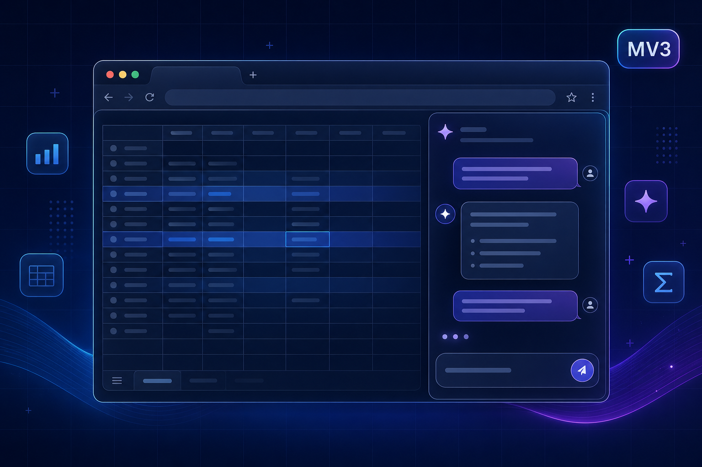

<div align="center">

# Smartsheet Controller — Chrome extension

<h3>The same AI stack, docked beside Smartsheet.</h3>

<p>This folder is the <strong>Manifest V3</strong> Chrome extension from the parent repo:<br/>
<a href="https://github.com/Abdeltoto/smartsheet-controller">Smartsheet Controller</a> · MIT · community-built, not affiliated with Smartsheet Inc.</p>

[](#what-it-does)
[](#install-development)

<br />



<br />

<sub><i>Concept art — your Controller runs inside Chrome’s side panel next to your sheet.</i></sub>

<br />

[**What it does**](#what-it-does) ·
[**Install**](#install-development) ·
[**Use it**](#daily-use) ·
[**Configure**](#server-url-and-remote-deploy) ·
[**Privacy**](#privacy) ·
[**Extras (OAuth · prompts)**](#optional-features) ·
[**Developer**](#for-developers) ·
[**File map**](#file-map)

<br />

---

</div>

## What it does

| | |
|:---|:---|
| **Side panel** | Opens the **same** FastAPI + web UI you run locally (or host), in Chrome’s **side panel** — not a separate product. |
| **Sheet context** | On `app.smartsheet.com/.../sheets/<id>`, the extension reads the **sheet ID** from the URL and passes `sheet_id` + **`ssc_ext=1`** into the iframe so the landing can stay focused (less marketing chrome in embed). |
| **Toolbar hint** | A **blue dot** on the icon when a Smartsheet sheet URL is detected — quick signal that context is available. |

**Hotkey:** **`Ctrl+Shift+Y`** (Windows / Linux) · **`⌘⇧Y`** (macOS) · *Open Smartsheet Controller side panel.*

---

## Install (development)

1. Run the Controller backend from the repo root (default port **`8100`**):

   ```bash
   uvicorn backend.app:app --reload --port 8100
   ```

2. Open Chrome → **`chrome://extensions`** → enable **Developer mode**.

3. **Load unpacked** → select this **`extension`** folder.

4. (Optional for OAuth helpers) OAuth-related env vars on the server: see repo **`.env.example`**.

Nothing is published under this README until you ship **Phase D** (Chrome Web Store) — see **`store/`**.

---

## Daily use

1. Open any sheet at **[Smartsheet](https://app.smartsheet.com)** (optional; improves auto sheet ID).
2. Click the toolbar icon — or **`Ctrl+Shift+Y`** / **`⌘⇧Y`** — to open the **side panel**.
3. Inside the iframe: **Connect** with your API token (`BYOT`). The slim bar above the frame is tuned for narrow width; **the full web app** is unchanged.

---

## Server URL and remote deploy

- **Local dev:** defaults target **`http://127.0.0.1:8100`** (see `manifest.json` `host_permissions`).
- **Change server URL:** use the **⚙** control on the bar above the iframe, or **right‑click extension → Options**.
- **Deploy Controller on HTTPS:** add your origin to **`host_permissions`**, **`content_scripts`** `matches`, and **`web_accessible_resources`** `matches` in **`manifest.json`** so the embed script and CSS can load on your domain.

---

## Embed mode (`ssc_ext`)

The iframe loads:

`…/?ssc_ext=1&sheet_id=…`

`content/embed.js` + **`content/embed.css`** apply only when embedded (iframe or explicit query param), so users land closer to **Connect** without duplicated hero copy — better fit for a narrow strip.

---

## Privacy

Traffic goes to **your** Controller server (and Smartsheet as usual in another tab). This extension **does not** ship your tokens to a vendor “us” layer — configure your own backend; see Options copy for the same pledge.

---

## Optional features

| Feature | Summary |
|---------|---------|
| **OAuth (Smartsheet)** | Set `SMARTSHEET_OAUTH_CLIENT_ID` + `SMARTSHEET_OAUTH_CLIENT_SECRET` on the server. In **Extension Options**, register **`https://<extension-id>.chromiumapp.org/`** in Smartsheet Developer Tools, then **Sign in with Smartsheet** and paste the token into the Controller flow if needed. More: **`OUT-OF-SCOPE-ROADMAP.md`**. |
| **Prompt catalogue** | **`prompts-browser.html`** calls **`GET /api/prompts`** on your running server — no duplicate JSON tree. Options → *Open prompts in a new tab*. |

---

## Product & Store

| Resource | Purpose |
|---------|---------|
| **[`SIMPLIFICATION-PLAN.md`](SIMPLIFICATION-PLAN.md)** | Architecture checklist and phased roadmap. |
| **[`store/`](store/)** | Listing copy, privacy policy HTML, ZIP, screenshot checklist (**Phase D**). |

---

## For developers

### Icons

PNGs live in **`icons/`**. Regenerate after editing **`scripts/generate_icons.py`**:

```bash
cd extension && python scripts/generate_icons.py
```

Requires **Pillow** (`pip install pillow`).

### Next steps

- Package for **Chrome Web Store** (screenshots, privacy policy URL) — Phase D.
- Expand **`host_permissions`** / patterns for your production domain.

---

## File map

| Path | Role |
|------|------|
| **`manifest.json`** | MV3: side panel, options, icons, commands, permissions |
| **`background.js`** | Smartsheet URL → `chrome.storage.session` + badge dot |
| **`sidepanel.html`**, **`sidepanel.js`** | Thin bar + iframe URL builder |
| **`options.html`**, **`options.js`**, **`styles/options.css`**, **`oauth-options.js`** | Controller base URL + OAuth helpers |
| **`prompts-browser.html`**, **`prompts-browser.js`**, **`styles/prompts-browser.css`** | Prompts browser against live API |
| **`content/embed.js`**, **`content/embed.css`** | Embedded landing tweaks |
| **`scripts/generate_icons.py`** | Builds `icons/icon-*.png` |
| **`store/`** | Web Store assets |

---

<sub>Return to **[main README](../README.md)** · *Google Chrome* and related marks are trademarks of Google LLC.</sub>
